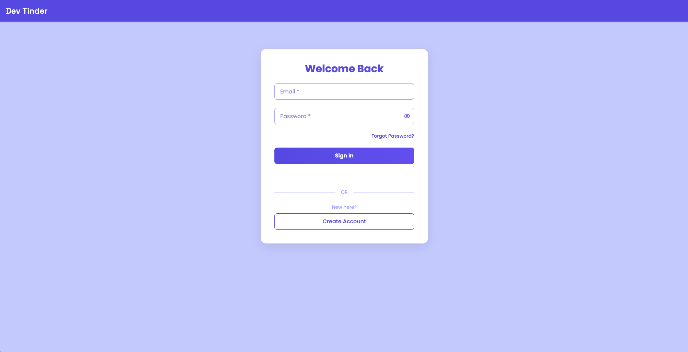
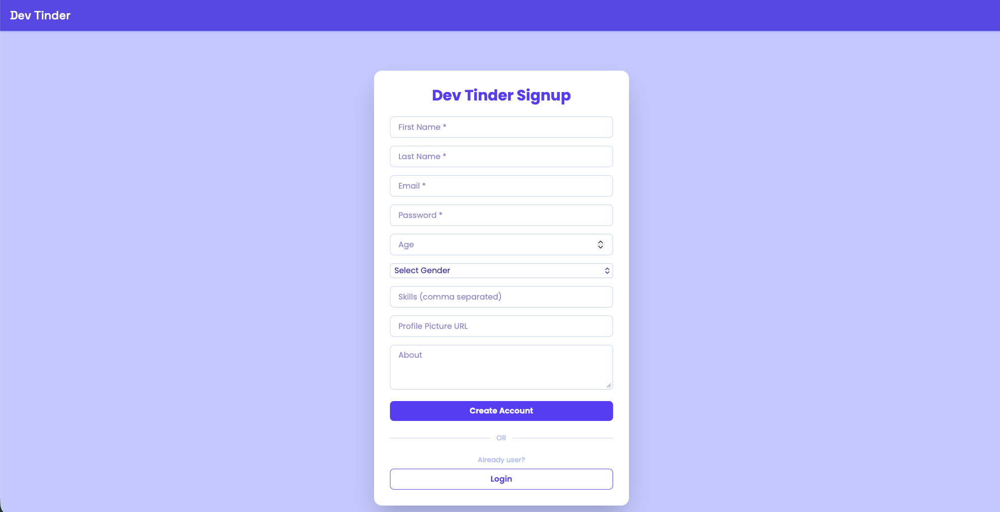
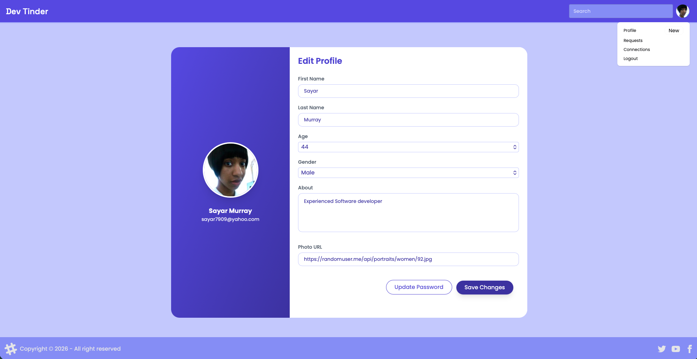
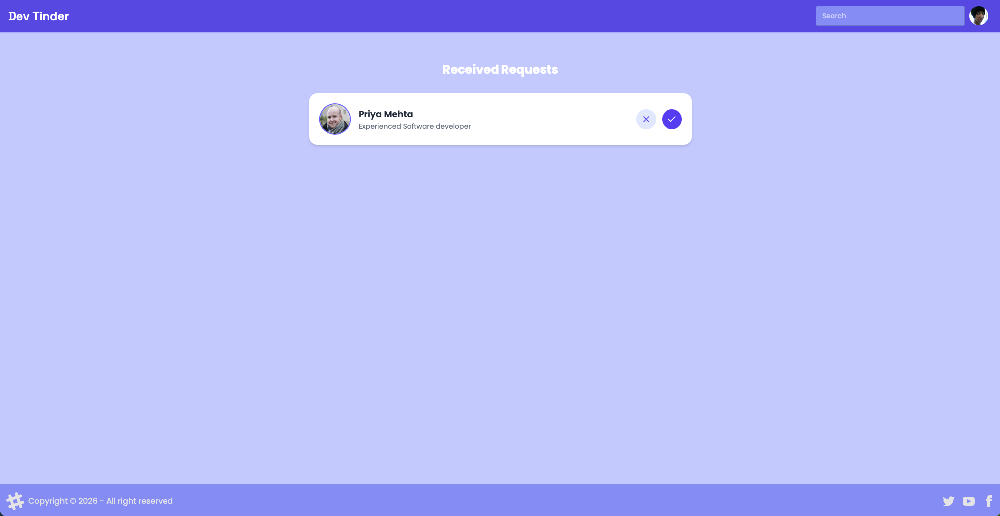

# Dev Tinder 🚀

**Dev Tinder** is a modern networking app for developers, inspired by the Tinder interface, designed to help developers discover, connect, and collaborate with fellow coders. Swipe, match, and build your dev circle seamlessly.  


## 🔥 Features

- **Swipe Interface:** Swipe right to like, left to pass on developer profiles.
- **Developer Profiles:** Showcase skills, tech stack, portfolio links, and GitHub stats.
- **User Connections:**  
  - Send connection requests.  
  - View all pending requests.  
  - Accept or decline requests.  
  - See all confirmed connections.
- **Authentication:**  
  - Registration page for new users.  
  - Secure login with JWT authentication.  
  - Password update and profile editing functionality.  
  - Logout functionality for session security.
- **Real-time Chat:** Chat instantly with matched developers. (under development)
- **Search & Filters:** Filter developers by programming language, experience, or location.
- **Responsive Design:** Optimized for desktop and mobile screens.
- **State Management:** Built with Redux Toolkit for handling complex state efficiently.
- **UI Styling:** Tailwind CSS for modern, responsive, and reusable components.


## 🛠️ Tech Stack

**Frontend:**  
React.js, Redux Toolkit, Tailwind CSS, HTML5, CSS3  

**Backend:**  
Node.js, Express.js, MongoDB, RESTful APIs, JWT Authentication  

**Hosting & Deployment:**  
AWS EC2 (public IP hosting)  

**Tools & Practices:**  
Git & GitHub, Firebase, CI/CD, Agile, Scrum, Performance Optimization, Responsive Design  


## 🚀 Getting Started

### Prerequisites

- Node.js v18+  
- MongoDB  
- npm or yarn

### Screenshots






### Installation

```bash
# Clone the repository
git clone https://github.com/<your-username>/dev-tinder.git
cd dev-tinder

# Install dependencies
npm install

# Start development server
npm run dev


